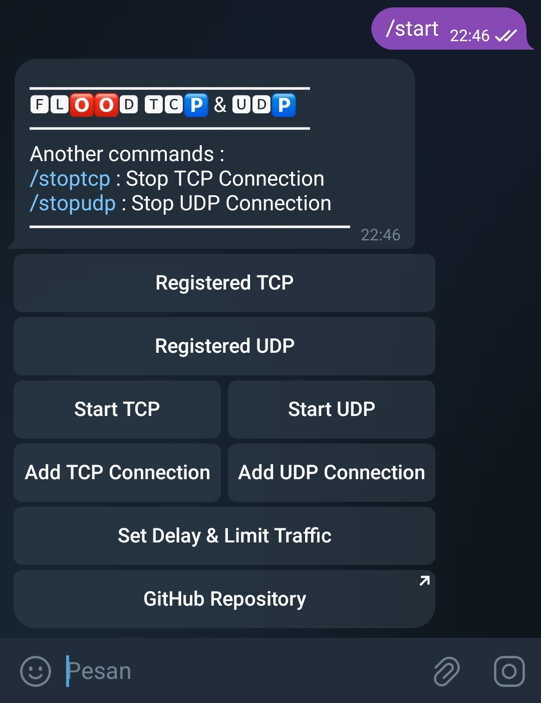
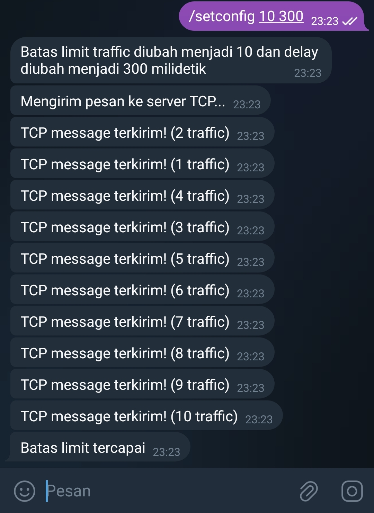
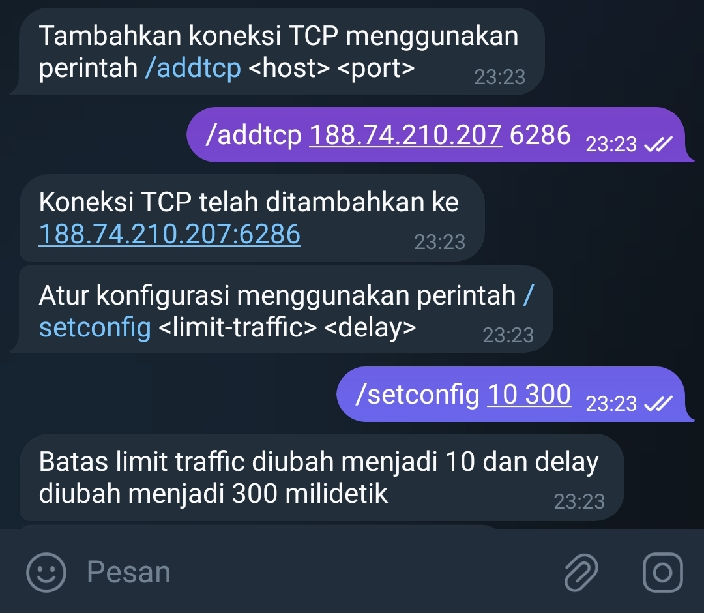

# Flood bot TCP & UDP

Bot sends flood traffic using TCP &amp; UDP protocols to target IP Address &amp; Port

TCP and UDP flood can usually be used to attack SAMP, FiveM, Minecraft and other servers. Do not use this script for what I said above, because the purpose of making this bot is only for learning or penetration testing, not to attack targets directly.

## All Information Command

| CMD      | Information      |
|--------------|--------------|
| Registered TCP | View Address TCP |
| Registered UDP | View Address UDP |
| Start TCP | Run Traffic TCP |
| Start UDP | Run Traffic UDP |
| Add TCP Connection | `/addtcp <host> <port>` |
| Add UDP Connection | `/addudp <host> <port>` |
| Set Delay & Limit | `/setconfig <limit-traffic> <delay>` |
| /stoptcp | Stop Connection TCP |
| /stopudp | Stop Connection UDP |

## ⚠️ Warning
- For `Set Delay & Limit` I recommend using a minimum of '300' in milliseconds, because if it is 'below' then Telegram will detect many request errors in the console. 

- and the `traffic limit` is free to enter whatever you like

## Screenshot on Bot

[]
[]
[]

## Requirements 

```bash
apt install nodejs git npm yarn
```

```bash
npm install node-telegram-bot-api net dgram yarn
```

## 🚀 Run this bot

- Prepare youre API Token telegram.

```bash
npm install floodtcpudp
```

```bash
mv node_modules/floodtcpudp ./
```

```bash
cd floodtcpudp
```

```bash
set your api token in config.js
```

- and for run this bot
```bash
yarn start
```


